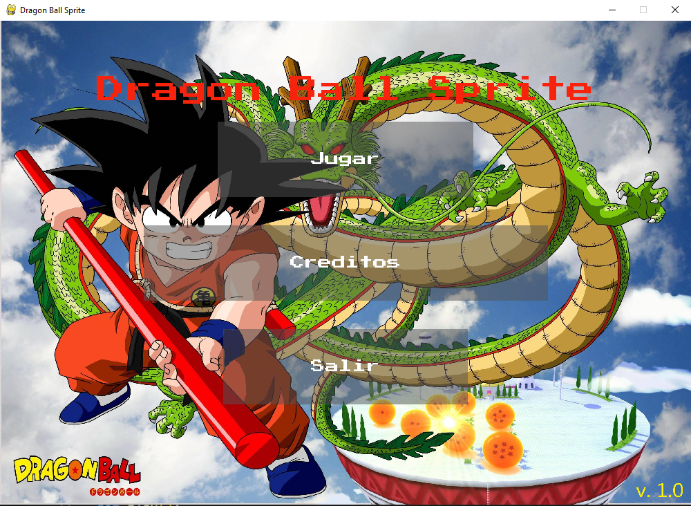

Dragon Ball Sprite



```bash
py -m pip install -r requirements.txt

```

Descripción
Dragon Ball Sprite es un juego desarrollado en Python utilizando la libreria Pygame.
El juego se basa en la popular serie de anime "Dragon Ball" y presenta elementos de juego de 
plataformas con gráficos de estilo sprite.

Requisitos
Python 3 (última versión)
Pygame
Pyvidplayer
Ffpyplayer

Instalación:
Asegúrate de tener Python 3 instalado. Si no lo tienes, descárgalo e instálalo desde python.org.
Clona o descarga este repositorio desde:  https://github.com
https://github.com/HoracioxBarrios/mi_juego_final_limpio.git
Instala las dependencias ejecutando el siguiente comando en tu terminal:
pip install pygame pyvidplayer ffpyplayer

py -m pip install -r requirements.txt

Link del video : https://youtu.be/wl7AXXmFNi0


Cómo jugar
Navega hasta el directorio del juego.
Ejecuta el archivo main.py con Python:

Controla al personaje principal con las teclas:

- [W] Poder -Kame
- [ESPACE] Saltar
- [E] Poder - (Secreto)
- Mover hacia arriba: ↑
- Mover hacia abajo: ↓
- Mover hacia la izquierda: ←
- Mover hacia la derecha: →


Características
Gráficos de estilo sprite inspirados en "Dragon Ball".
Mecánicas de juego de plataformas.
Música y efectos de sonido inmersivos.
Enemigos basados en personajes de la serie.


Créditos y agradescimintos:
Gracias a los aportes de los recursos musica, sonidos, imagenes, sprites,etc.
Tambien agradezco las ideas aportadas y la ayuda de mis compañeros. 

Autor: Horacio Barrios
Universidad: Universidad Tecnológica Nacional (UTN)
Este es un proyecto para la Universidad Tecnológica Nacional (UTN) corresponde al final del 1er
cuatrimenstre de las materias Programacion y Laboratorio.

Licencia
Este proyecto se encuentra bajo la licencia MIT License.

-----------------------------------------------------------------------------------------------
Juego Seleccionado dentro de los 3 Mejores entre mas de 60 que fueron entregados al final de 
la cursada 2023.


